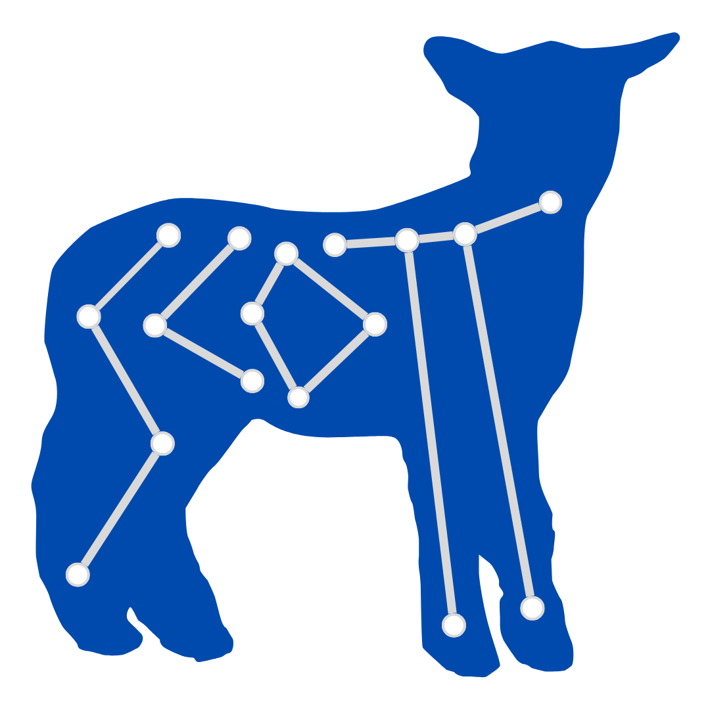

.. SCOTT documentation master file, created by
   sphinx-quickstart on Tue Dec 17 13:33:03 2024.
   You can adapt this file completely to your liking, but it should at least
   contain the root `toctree` directive.

SCOTT: Synthesizing Curvature Operations and Topological Tools 
====================================================================================

:code:`SCOTT` is a Python package for computing **curvature filtrations** for graphs and graph distributions. This repository accompanies our NeurIPS 2023 paper: `Curvature Filtrations for Graph Generative Model Evaluation <https://arxiv.org/abs/2301.12906>`_.

Our method introduces a novel way to compare graph distributions, avoiding the limitations of Maximal Mean Discrepancy (MMD), which has known `drawbacks <https://arxiv.org/abs/2106.01098>`_.

By combining **discrete curvature** on graphs with **persistent homology**, :code:`SCOTT` provides expressive descriptors of graph sets that are:

* **Robust**
* **Stable**
* **Expressive**
* **Compatible with Statistical Testing**

The package is highly adaptable, offering several options for **user customization**, including different curvature computation methods and diverse metrics for comparing persistent homology outputs.

Installation
-------------

**Using pip**

Install `curvature-filtrations` via pip: ::

   pip install curvature-filtrations

**Building from Source**

Our dependencies are managed with `poetry <https://python-poetry.org>`_, which can be installed with :code:`pip install poetry`. To install from source:

Clone the repository: ::

   git clone https://github.com/aidos-lab/curvature-filtrations.git

Navigate to the directory: ::

   cd curvature-filtrations

Install dependencies: ::

   poetry install

Quick Start
-------------

The :code:`example.py` script demonstrates how to compute the distance between two graph distributions.

To use SCOTT with your own data, replace the example graph distributions with your own. Distributions should be lists of `networkx` graphs or single `networkx` graphs.

Run our Example Script: ::

   python scripts/example.py

Tutorials
-------------

For a walkthrough of customization options and the intermediary functionalities supported by SCOTT objects, please see `/notebooks`. We offer the following two tutorials:

1. Customizing how your comparison is executed
^^^^^^^^^^^^^^^^^^^^^^^^^^^^^^^^^^^^^^^^^^^^^^^^^^^^^^^^^^^^^^^^^^^^^^^
:code:`custom_compare.ipynb`

**Read this section if:** Your primary goal is to find the distance between your graph distributions, but you are looking for additional ways to customize the curvature and distance measures used.

Functionalities demonstrated in this tutorial include:
* Changing the method used for curvature calculations and associated hyperparameters
* Selecting and customizing the vectorization used to compare persistence diagrams

2. Breakdown of intermediate functionalities
^^^^^^^^^^^^^^^^^^^^^^^^^^^^^^^^^^^^^^^^^^^^^^^^^^^^^^^^^^^^^^^^^^^^^^^
:code:`bagpipeline.ipynb`

**Read this section if:** You want to better understand the underlying workflow of this process and/or are interested in the output from intermediate steps in the process.

Functionalities demonstrated in this tutorial include:
* Calculating curvature for one graph or graph distribution
* Executing a curvature filtration to produce a persistence diagram
* Converting persistence diagrams into a topological descriptor (e.g. persistence landscape)
* Computing the distance between topological descriptors

Both tutorials are supported by helper functions in :code:`/notebooks/utils.py`.

Documentation
-------------

Please find the module documentation below.

.. toctree::
   :maxdepth: 2
   :caption: Contents:

.. toctree::
   :maxdepth: 2
   :caption: Modules

   kilt
   compare
   geometry
   topology
